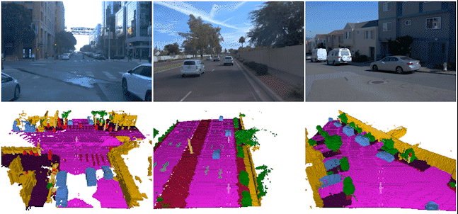
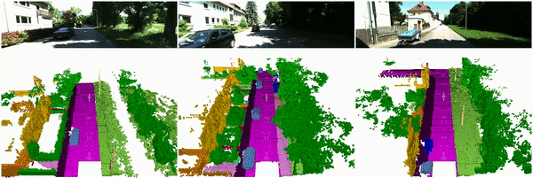

  
  
# SSCBench: A Large-Scale 3D Semantic Scene Completion Benchmark for Autonomous Driving

  
  

  
SSCBench-Waymo

  
  

  
SSCBench-KITTI-360

 
  

SSCBench-nuScenes

> SSCBench: A Large-Scale 3D Semantic Scene Completion Benchmark for Autonomous Driving
> 
> [Yiming Li](https://scholar.google.com/citations?hl=en&user=i_aajNoAAAAJ&view_op=list_works&sortby=pubdate), [Sihang Li], [Xinhao Liu], [Moonjun Gong], [Kenan Li], [Nuo Chen], [Zijun Wang], [Zhiheng Li], [Tao Jiang], [Fisher Yu], [Yue Wang], [Hang Zhao], [Zhiding Yu](https://scholar.google.com/citations?user=1VI_oYUAAAAJ&hl=en), [Chen Feng](https://scholar.google.com/citations?user=YeG8ZM0AAAAJ&hl=en)

>  [[PDF]](https://github.com/ai4ce/SSCBench/) [[Project]](https://github.com/ai4ce/SSCBench/edit/main/README.md) 

## News
- [2023/06]: SSCBench has been submitted to NeurIPS 2023 Datasets and Benchmarks.

